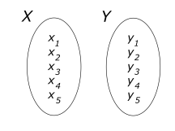
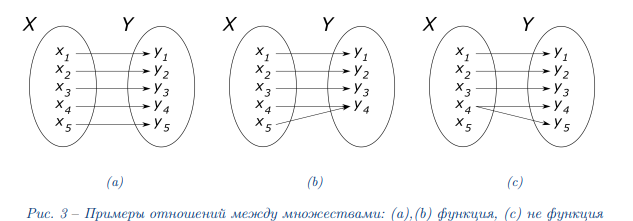

***Билет 1***\
**Множество. Функция. Скалярные и векторные функции**

**Множество** – совокупность некоторых объектов, называемых элементами множества.\
\
Способы задать множество:

- Перечисление X = {x1,x2,x3...}
- Описание свойств элементов xi, определяющих их пренадлежность множеству Х.
  Пример: X = {x | x ∈ N , x < 175} - натуральные меньше 175\

Пример множеств: множество студентов группы, множество фруктов на столе, множество всех целых чисел.

Выделяют также особый вид множества – пустое множество

**Декартово произведение двух множеств** – множество, элементами которого являются все возможные упорядоченные пары
элементов исходных множеств.

**Функция** – бинарное отношение между двумя множествами X и Y ,
при котором каждому элементу множества X соответствует один и только один элемент множества Y.



**Скалярные** - те функции, которые возвращают одно значение.
Скалярные функции должны быть детерминированными.
(Это значит, что для одних и тех же входных параметров они должны генерировать одно
и то же выходное значение)

**Вектор-функция** — функция, значениями которой являются векторы в векторном пространстве V двух, трёх или более
измерений.
Аргументами функции могут быть:

- одна скалярная переменная — тогда значения вектор-функции определяют в V некоторую кривую;
- m скалярных переменных — тогда значения вектор-функции образуют в V, вообще говоря, m-мерную поверхность;
- векторная переменная — в этом случае вектор-функцию обычно рассматривают как векторное поле на V.

[Конспект](https://www.open.etu.ru/assets/courseware/v1/e4d0e1e7127f0648b1d16939355df28e/asset-v1:kafedra-cad+opt-methods+spring_2024+type@asset+block/конспект1_1.pdf)

***Запрограммировать метод доверительных областей. Показать его работу на функциях Sphere и Ackley, размерность d = 2***
[КОД](https://www.open.etu.ru/courses/course-v1:kafedra-cad+opt-methods+spring_2024/courseware/36e24e85aa75401a9ac7002730b64bb0/216c21b8e9bc4aaf82f40ca52a72d9f3/1?activate_block_id=block-v1%3Akafedra-cad%2Bopt-methods%2Bspring_2024%2Btype%40vertical%2Bblock%403efa8bfb7030457faf40de0804b09543)

```python
import numpy as np
def trustreg(f, df, x0, tol):
    coords = [x0]
    kmax = 1000
    r_delta = 1

    radii = [r_delta]

    # величина константы для принятия решения о выборе нового шага
    eta = 0.1
    dmax = 0.1

    H0 = np.zeros((2, 2))
    H0[0][0] = 1
    H0[1][1] = 1

    dk = 1

    while (norm(dk) >= tol) and (len(coords) < kmax):
        curr_grad = df(x0)

        # квазиньютоновский подход
        mk = lambda x: (f(x0) + np.dot(np.array(x).transpose(), df(x0)) + 1 / 2 * np.dot(np.array(x).transpose(),
                                                                                         np.dot(H0, np.array(x))))

        # ищем доверительную область
        p = doglegsearch(mk, df(x0), H0, r_delta, tol)

        ro = ((f(x0) - f(x0 + p)) / (mk(0) - mk(p)))[0][0]
        if np.abs(ro) > eta:
            # смещаем x0 на p
            dk = p
            x0 = x0 + p
        else:
            break

        if np.abs(ro) < 1 / 4:
            r_delta *= 1 / 4
        elif (np.abs(ro) > 3 / 4 and norm(p) == r_delta):
            r_delta = min(2 * r_delta, dmax)

        radii.append(r_delta)

        yk = df(x0) - curr_grad

        yk_transoped = yk.transpose()

        second_elem = np.dot(yk, yk_transoped) / np.dot(yk_transoped, dk)
        up = np.dot(H0, np.dot(dk, np.dot(dk.transpose(), H0)))
        down = np.dot(dk.transpose(), np.dot(H0, dk))

        H0 = H0 + second_elem - up / down

        coords.append(x0)

    answer_ = [x0, f(x0), len(coords), coords, radii]
    return answer_
```

ACKLEY\


SPHERE\

