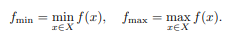
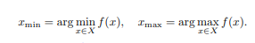
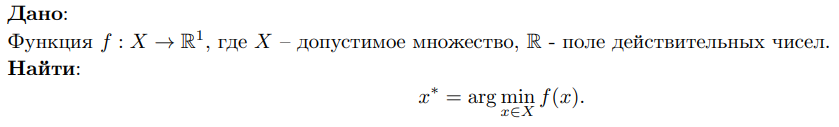

***Билет 3***\
**Критические точки. Стационарные точки. Лемма Ферма. Связь оптимизации и поиска корня.**

**Критические точки** функции f(x) – точки, в которых производная f0(x) не существует или обращается в нуль.

**Стационарные точки** функции f(x) – точки, в которых производная f0(x) обращается в нуль.

**Стационарные точки делятся на**:

- экстремумы
- седловые точки (точки перегиба)

**Экстремум** – максимальное или минимальное значение функции на заданном множестве.



**Точки экстремума** - значения аргумента функции, в которой она достигает экстремум.



**По числу экстремумов функции делятся на**:

- унимодальные (с 1 экстремумом)
- многоэкстремальные

**Лемма Ферма**

- Производная f 0(x) дифференцируемой функции в точке экстремума равна нулю.

**Необходимое, но недостаточное условие экстремума гласит:**

- Экстремум достигается в критической точке.

**Достаточные условия экстремума:**

- Пусть функция f(x) принадлежит классу непрерывных функций C , т.е. не претерпевает разрывов.
  Пусть x∗ - критическая точка. Пусть в окрестности этой точки есть две
  односторонние производные, левая f'-(x) < 0 и правая f'+(x) > 0. Тогда x∗ – минимум.
- Пусть f(x) дважды дифференцируема в точке x∗.
  Если первая производная функции в этой точке нулевая, а вторая – положительная,
  то x ∗ – минимум.

**Задача оптимизации**
Строго математически, она формулируется так:



**Связь оптимизации и поиска корня**:

Так как оптимизация - поиск точки минимума функции (или максимума, но эта операция решается поиском минимума
обратной функции), то такую задачу можно представить как задачу поиска корня функции g(x) = f'(x).

[Конспект](https://www.open.etu.ru/assets/courseware/v1/0516d2c7dc39c3bc571e4d0c1962bf64/asset-v1:kafedra-cad+opt-methods+spring_2024+type@asset+block/конспект1_3.pdf)

***Запрограммировать метод BFGS. Показать его работу на функциях Sphere и Eggholder, размерность d = 2***

SPHERE


Eggholder


```python 
def BFGS(f, df, x0, tol=1e-8, kmax=1000):
    n = len(x0)
    x = x0
    coords = [x]

    Hk = np.eye(n)  # Initial approximation of the inverse Hessian matrix
    k = 0
    c1 = 1e-5
    c2 = 1e-2
    amax = 1
    dk = 1000

    while (norm(dk) >= tol) and k < kmax:
        gk = df(x)

        if np.linalg.norm(gk) < tol:
            break

        pk = -np.dot(Hk, gk)

        alpha = wolfesearch(f, df, coords[-1], pk, amax, c1, c2)
        # alpha = armijo(f, df, x, pk)
        dk = alpha * pk
        x_new = x + dk
        sk = x_new - x
        x = x_new

        gk_new = df(x)
        yk = gk_new - gk

        rho_k = 1.0 / np.dot(yk.transpose(), sk)

        I = np.eye(n)
        term1 = I - rho_k * np.outer(sk, yk)
        term2 = I - rho_k * np.outer(yk, sk)
        Hk = np.dot(term1, np.dot(Hk, term2)) + rho_k * np.outer(sk, sk)

        coords.append(x)
        k += 1

    return [coords[-1], f(coords[-1]), len(coords), coords]

```
