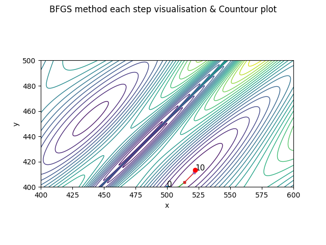
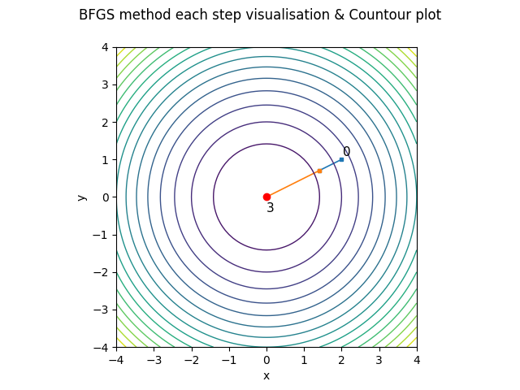

***Билет 4***\
**Градиент. Матрица Гессе. Ряд Тейлора.**

**Градиент** – обобщение производной функции на многомерный случай. Это вектор частных производных f по каждой из компонент
вектора x:


**Матрица Гессе** – обобщение второй производной функции на многомерный случай. Это
матрица вторых частных производных ∇^2f по каждой из компонент вектора x:


Для всякой достаточно гладкой функции в окрестности точки x0 существует полиномиальная аппроксимация - **Ряд Тейлора**


Ряд Маклорена – ряд Тейлора при разложении в окрестности точки 0

***Запрограммировать метод DFP. Показать его работу на функциях Sphere и Cross-in-Tray, размерность d = 2***

[КОД](https://www.open.etu.ru/courses/course-v1:kafedra-cad+opt-methods+spring_2024/courseware/36e24e85aa75401a9ac7002730b64bb0/aaa3efee0aad4c55af9c1c24b117d183/1?activate_block_id=block-v1%3Akafedra-cad%2Bopt-methods%2Bspring_2024%2Btype%40vertical%2Bblock%40665f107ef7fc4f20b6cc7939188d04b2)




```python 
def dfpsearch(f, df, x0, tol):
    coords = [x0]
    kmax = 1000
    c1 = tol
    c2 = 0.1
    amax = 3
    dx = 1
    H = np.ones((2, 2))
    H[0][1] = 0
    H[1][0] = 0

    while (norm(dx) >= tol) and (len(coords) < kmax):
        g = df(coords[-1])

        p = np.dot(-H, g)

        ak = wolfesearch(f, df, coords[-1], p, amax, c1, c2)

        dx = ak * p

        coords.append(coords[-1] + dx)

        dy = df(coords[-1]) - g

        dx_transposed = dx.transpose()
        dy_transposed = dy.transpose()

        second = np.dot(dx, dx_transposed) / np.dot(dx_transposed, dy)
        third = np.dot(H, np.dot(np.dot(dy, dy_transposed), H)) / np.dot(np.dot(dy_transposed, H), dy)

        H += (second - third)


    answer_ = [coords[-1], f(coords[-1]), len(coords), coords]
    return answer_

```
