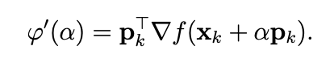
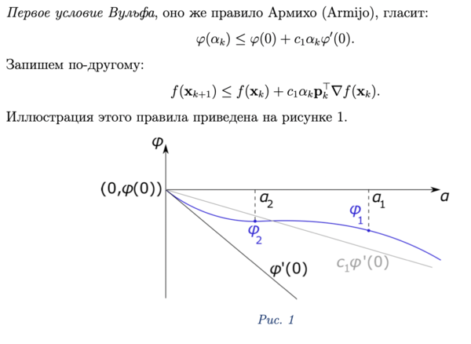
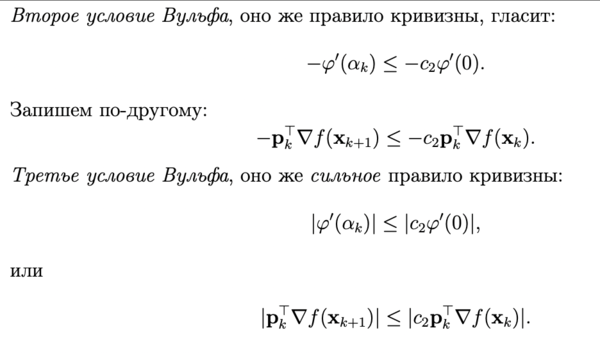
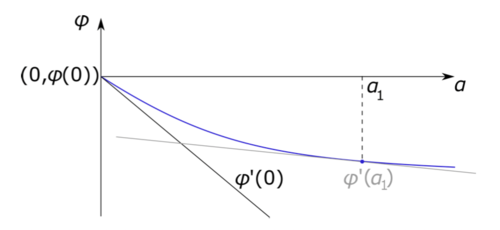

***Билет 7***\
**Условия Вульфа. Их геометрическая интерпретация. Правило Армихо.**

Пусть мы решаем задачу оптимизации
x* = argminf(x).

Решение ищем методом спуска вида xk+1 =xk +αkpk, где pk – текущее направление поиска. 
Длину шага αk можно найти методами точной оптимизации функции φ(α) = f(xk + αpk), но это долго.

Сделаем здесь небольшую ремарку о производной целевой функции. 

Напомним, что производная функции φ(α) = f(xk + α*pk)
по α равна:


Возвращаясь к поиску длины шага напомним, что длина шага αk в методе спуска
xk+1 =xk +αk*pk должна давать:
1. «Достаточное» уменьшение значения целевой функции φ(α),
2. «Достаточное» уменьшение значения производной φ′(α).
   
**Условия Вульфа служат для того, чтобы перевести неточное понятие «достаточности»на
язык математики.**



Точка α1 не удовлетворяет первому условию Вульфа, точка α2 ему удовлетворяет.



Первое и третье правила Вульфа дают **сильные условия Вульфа**, которые могут использоваться вместо условия Армихо, 
чтобы гарантировать сходимость к нулю производной ∇f (xk).

Рисунок ниже иллюстрирует сильное правило кривизны.


**В точке α1 производная φ′(α1) меньше по абсолютной величине, чем φ′(0).**

[Конспект](https://open.etu.ru/assets/courseware/v1/b21b597962089ca40784ecb03591f1e1/asset-v1:kafedra-cad+opt-methods+spring_2024+type@asset+block/конспект3_6.pdf)


***Запрограммировать  метод  Армихо. Показать его работу на функциях 
f(x) = -2*sin(sqrt(abs(x/2 + 10))) - x.*sin(sqrt(abs(x - 10))),
f(x) = x.^2 -  10*cos(0.5*pi*x) – 110,
Поисковый интервал в обоих случаях [0,10].***
[КОД](https://www.open.etu.ru/courses/course-v1:kafedra-cad+opt-methods+spring_2024/courseware/36e24e85aa75401a9ac7002730b64bb0/216c21b8e9bc4aaf82f40ca52a72d9f3/1?activate_block_id=block-v1%3Akafedra-cad%2Bopt-methods%2Bspring_2024%2Btype%40vertical%2Bblock%403efa8bfb7030457faf40de0804b09543)

```python
    def armijo(f, df, x, p, s, c1):
        fi = lambda alfa: f(x + alfa * p)
        dfi = lambda alfa: np.dot(p.transpose(), df(x + alfa * p))
    
        # Задаем начальные условия
        a = s
        b = 0.15
        fi0 = fi(0)
        dfi0 = dfi(0)
        kmax = 1000
    
        for k in range(kmax):
            if fi(a) <= fi0 + c1 * a * dfi0:
                break
            else:
                a = b * a
    
        return a
```
