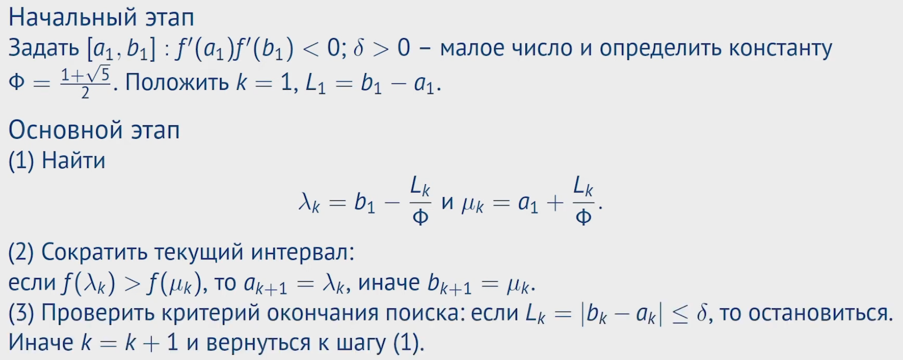

**Метод золотого сечения (Golden Section Search) - это численный метод оптимизации, который используется для нахождения экстремумов (минимумов или максимумов) функции на заданном интервале. Его основная идея заключается в эффективном уменьшении размера интервала поиска путем деления его в пропорции золотого сечения.**

**Определение из лекции:** Метод золотого сечения является процедурой линейного поиска минимума унимодальной функции 𝑓(𝑥) на замкнутом интервале [𝑎,𝑏], требующей не 2, а только 1 вычисление целевой функции на итерации за счет свойства самоподобия отрезков, разделенных в отношении золотого сечения.

**Золотое сечение определяется следующим образом:** общая длина отрезка, разделенного в отношении золотого сечения, так относится к большей части, как большая часть относится к меньшей.

### Особенности использования метода золотого сечения:

- **Применимость**: Метод золотого сечения применяется, когда функция унимодальна на заданном интервале, то есть имеет только один экстремум. Он эффективен для поиска экстремума на небольших интервалах и не требует дифференцируемости функции.
- **Эффективность**: Метод золотого сечения эффективен для функций, которые не могут быть аналитически оптимизированы, а также в случаях, когда невозможно вычислить производные функции.
- **Недостатки**: Метод золотого сечения может быть неэффективен в случае, если функция имеет несколько экстремумов на интервале, так как он находит только один экстремум. Кроме того, этот метод может быть медленным на больших интервалах из-за линейной скорости сходимости.

### Шаги метода

1. Задается начальный интервал поиска, на котором предполагается наличие экстремума.
2. Интервал делится на две части так, чтобы отношение длины большего сегмента к меньшему было примерно равно золотому сечению (примерно 1.618).
3. Оцениваются значения функции в точках деления.
4. Выбирается новый интервал, исключая ту часть, в которой значение функции больше (для поиска минимума) или меньше (для поиска максимума).
5. Процесс повторяется до достижения заданной точности.

### Вопросы потенциальные:

1. Можно ли сказать, что метод золотого сечения быстрее метода дихотомии в Φ раз?
- Нет, оба имеют одинаковую точность О(log(1/E), где Е - требуемая точность) и сопоставимы по скорости. Золотое сечение может быть чуть быстрее из-за оптимальности выбора интервала.