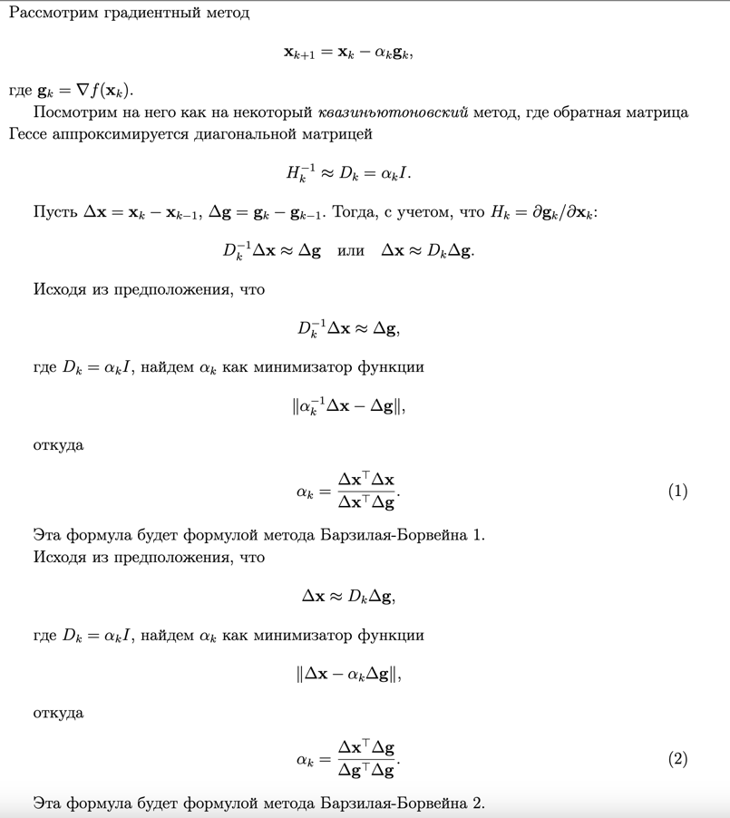
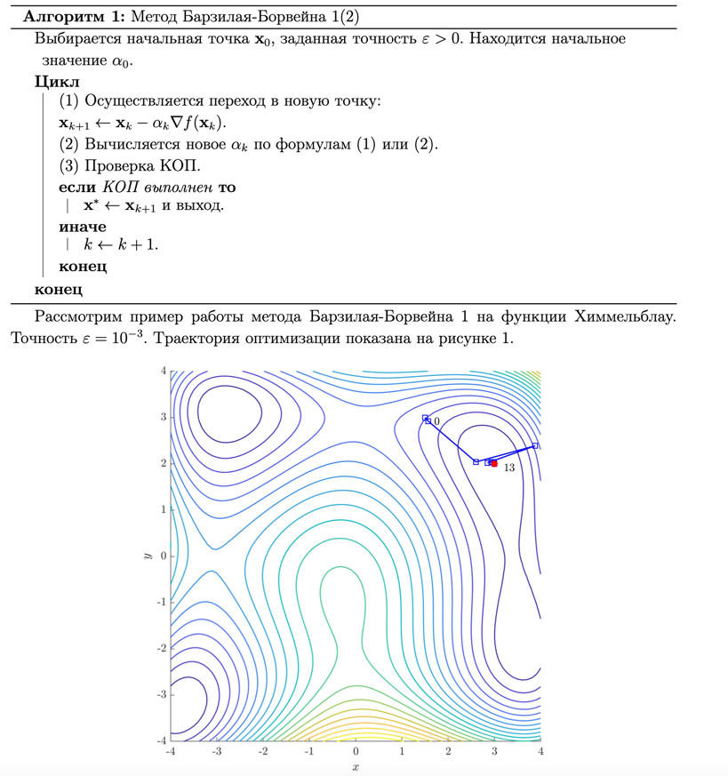

### Преимущества
1. Обладают в ряде случаев сверхлинейной сходимостью и глобальной сходимостью.

[Теория из лекции](https://www.open.etu.ru/assets/courseware/v1/5275e1fa87b6a085b244266f8a2b6c54/asset-v1:kafedra-cad+opt-methods+spring_2024+type@asset+block/конспект3_5.pdf)