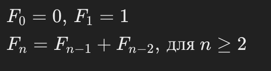
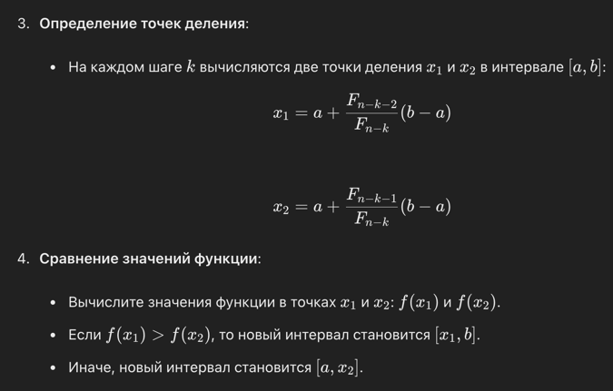
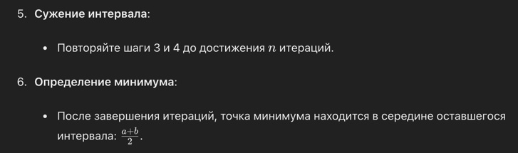

Метод Фибоначчи — это численный метод поиска минимума или максимума непрерывной функции на заданном интервале. Этот метод принадлежит к семейству методов деления интервала, и он использует числа Фибоначчи для определения точек деления. Метод эффективен для задач одномерной оптимизации и не требует вычисления производных функции.

Числа Фибоначчи
Последовательность Фибоначчи определяется как:

Числа Фибоначчи обладают свойством, что отношение двух последовательных чисел Фибоначчи стремится к золотому сечению (≈ 0.618) по мере увеличения 𝑛.

Шаги Метода Фибоначчи

Инициализация:
1. Задайте начальный интервал [𝑎 , 𝑏].
Выберите количество итераций 𝑛, которое связано с точностью поиска.
3. Вычислите числа Фибоначчи до 𝐹_𝑛

Преимущества:
Метод не требует вычисления производных функции, что делает его применимым для широкого класса функций.
Обеспечивает равномерное сужение интервала поиска, что гарантирует нахождение минимума с заданной точностью. 

Недостатки: Требует заранее заданного числа итераций, что может быть сложно определить.
Эффективен только для одномерных задач.
