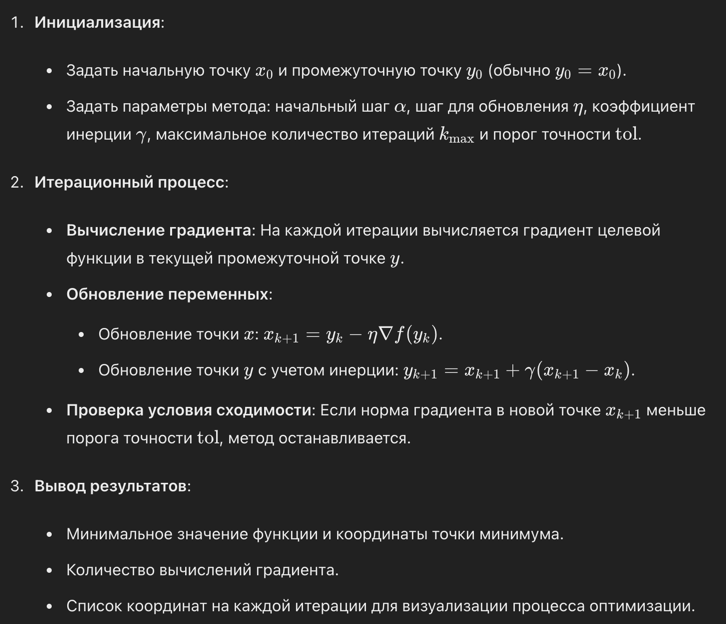

Метод Нестерова-Немировского (или ускоренный градиентный метод Нестерова) является одним из методов оптимизации, предназначенных для ускорения сходимости градиентных методов. Он был предложен Ю. Нестеровым в 1983 году и стал одним из наиболее эффективных методов для решения задач выпуклой оптимизации. Этот метод использует идею инерции для улучшения скорости сходимости.

### Основные шаги метода

### Преимущества метода
1. Ускоренная сходимость: Метод Нестерова обеспечивает более быструю сходимость по сравнению с классическим градиентным методом. Для выпуклых функций он имеет скорость сходимости O(1/k^2), где k — номер итерации.
2. Инерция: Использование инерционного члена помогает методу преодолевать локальные минимумы и снижать эффект "пилообразности" траектории.
3. Простота реализации: Метод легко реализуется и не требует сложных вычислений.

### Недостатки метода
1. Чувствительность к выбору параметров: Как и многие методы оптимизации, метод Нестерова чувствителен к выбору параметров α, η и γ. Неправильный выбор этих параметров может привести к медленной сходимости или даже к дивергенции.
2. Не подходит для всех задач: Хотя метод хорошо работает для выпуклых задач, он может не дать существенных преимуществ для невыпуклых задач или задач с большими шумами в градиенте.
3. Необходимость вычисления градиента: Метод требует точного вычисления градиента функции, что может быть затруднительно для некоторых сложных или дискретных функций.