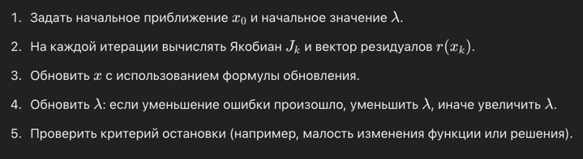
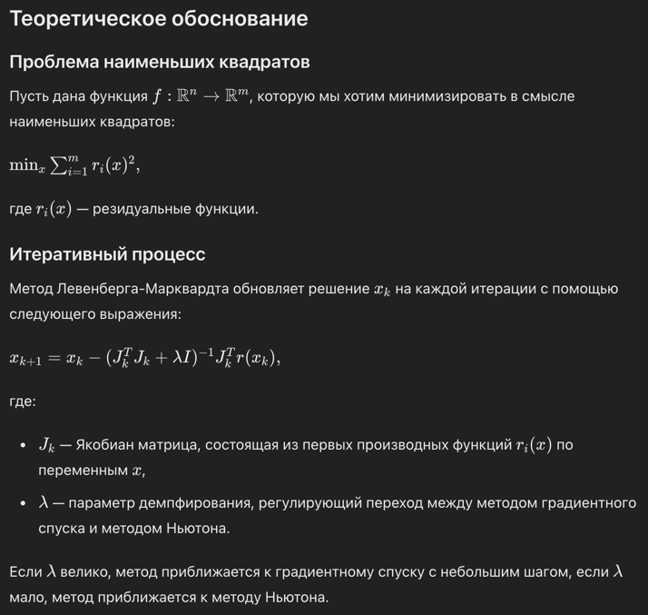

Метод Левенберга-Марквардта (LM) — это итеративный метод для решения нелинейных задач наименьших квадратов, который можно рассматривать как сочетание градиентного спуска и метода Ньютона. Он используется для минимизации суммы квадратов нелинейных функций.

### Алгоритм

### Преимущества метода Левенберга-Марквардта
1. Комбинация методов Ньютона и градиентного спуска: Метод Левенберга-Марквардта сочетает преимущества методов Ньютона и градиентного спуска. Это позволяет ему эффективно работать как при хороших начальных приближениях (приближаясь к методу Ньютона), так и при далеких (приближаясь к градиентному спуску).
2. Стабильность: За счет введения параметра демпфирования λ, метод может избегать проблем, связанных с плохо обусловленными матрицами Якоби, что делает его более стабильным в некоторых случаях по сравнению с методом Ньютона.
3. Эффективность для задач наименьших квадратов: Метод специально разработан для задач минимизации суммы квадратов и хорошо подходит для задач, связанных с регрессией и нелинейной аппроксимацией данных.
4. Адаптивность: Параметр λ автоматически регулируется в процессе оптимизации, что позволяет методу адаптироваться к форме поверхности ошибки и эффективно находить минимум.

### Недостатки метода Левенберга-Марквардта
1. Зависимость от начального приближения: Как и многие другие методы оптимизации, метод Левенберга-Марквардта чувствителен к выбору начального приближения. Плохое начальное приближение может привести к медленной сходимости или к нахождению локального минимума, а не глобального.
2. Требования к вычислениям Якобиана: Метод требует вычисления и хранения матрицы Якобиана, что может быть вычислительно затратным и занимать много памяти для больших задач.
3. Не подходит для сильно нелинейных задач: В некоторых сильно нелинейных задачах метод может столкнуться с трудностями, так как он основан на линейной аппроксимации вокруг текущего приближения.
4. Необходимость выбора параметров: Хотя параметр λ регулируется автоматически, начальное значение и правила его изменения могут повлиять на эффективность метода. Подбор этих параметров может требовать дополнительных экспериментов.
5. Ограниченность применения: Метод Левенберга-Марквардта специально разработан для задач наименьших квадратов и может быть неэффективным или непригодным для других типов задач оптимизации.

