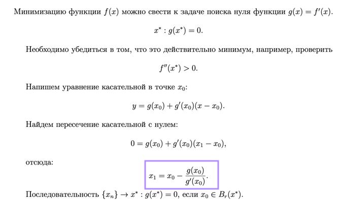
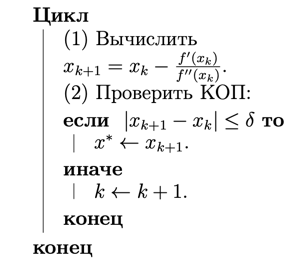
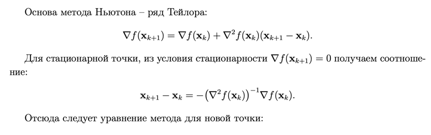
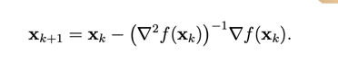

**Задание 1**

[Конспект](https://open.etu.ru/assets/courseware/v1/9448ccec71a33ee6a50e4ed38c5adc37/asset-v1:kafedra-cad+opt-methods+spring_2024+type@asset+block/%D0%BA%D0%BE%D0%BD%D1%81%D0%BF%D0%B5%D0%BA%D1%822_3.pdf) Метод  Ньютона одномерный.

[КОД](https://open.etu.ru/courses/course-v1:kafedra-cad+opt-methods+spring_2024/courseware/0648cf091a7240d8a93f52d3d9a9eeb7/1892a8c60fe64d178958642ad4b56889/?child=first)

**Вывод оптимизационной формулы:**

(Иногда Каримов спрашивал про то, почему там минус и может ли быть там плюс)

Псевдокод:

**Задание 2**

[Конспект](https://open.etu.ru/assets/courseware/v1/1711a0d7f45666ba3abfce8b698220e6/asset-v1:kafedra-cad+opt-methods+spring_2024+type@asset+block/%D0%BA%D0%BE%D0%BD%D1%81%D0%BF%D0%B5%D0%BA%D1%823_3.pdf) Многомерный метод Ньютона.

[КОД](https://open.etu.ru/courses/course-v1:kafedra-cad+opt-methods+spring_2024/courseware/36e24e85aa75401a9ac7002730b64bb0/52f0ccb5fecd4b308a3e99ac6ff041f9/?child=first)

**Вывод оптимизационной формулы:**

