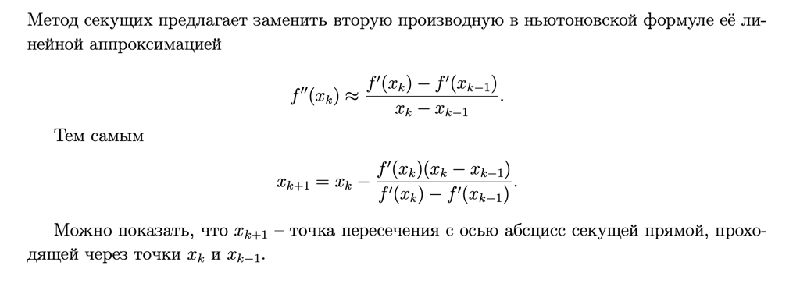
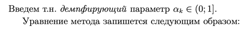
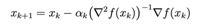

**Задание 1**

[Ссылка на конспект](https://open.etu.ru/assets/courseware/v1/9448ccec71a33ee6a50e4ed38c5adc37/asset-v1:kafedra-cad+opt-methods+spring_2024+type@asset+block/%D0%BA%D0%BE%D0%BD%D1%81%D0%BF%D0%B5%D0%BA%D1%822_3.pdf)
Метод секущих

Для адекватных картинок код вставить лучше [сюда](https://open.etu.ru/courses/course-v1:kafedra-cad+opt-methods+spring_2024/courseware/0648cf091a7240d8a93f52d3d9a9eeb7/e91cad57066a4ec2b2cff3c8460919a3/1?activate_block_id=block-v1%3Akafedra-cad%2Bopt-methods%2Bspring_2024%2Btype%40vertical%2Bblock%4065ed7aad32174c7bb1d058fc6aa0ea05)

**Вывод формулы**

Преимущества и недостатки метода секущих:
1. В отличие от метода Ньютона, метод секущих гарантирует сходимость точек xk к
стационарной точке x*
2. Сходимость метода достигается ценой потери быстродействия. Как правило, метод
дихотомии оказывается эффективнее метода секущих.

**Задание 2**

[Ссылка на конспект
](https://open.etu.ru/assets/courseware/v1/1711a0d7f45666ba3abfce8b698220e6/asset-v1:kafedra-cad+opt-methods+spring_2024+type@asset+block/%D0%BA%D0%BE%D0%BD%D1%81%D0%BF%D0%B5%D0%BA%D1%823_3.pdf)Демпфированный метод Ньютона

Для функции векторного переменного метод Ньютона формулируется практически точно
так же, как и для функции скалярного переменного.

Смысл выбора параметра заключается в том, что он должен 
"увеличивать" область притяжения минимума