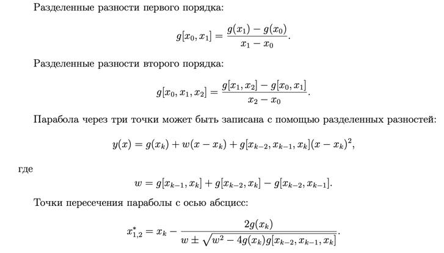

**Задание 1**

[Ссылка на конспект
](https://open.etu.ru/assets/courseware/v1/c79ebb156488d8b913f60ab76bc23cc9/asset-v1:kafedra-cad+opt-methods+spring_2024+type@asset+block/%D0%BA%D0%BE%D0%BD%D1%81%D0%BF%D0%B5%D0%BA%D1%822_4.pdf)
Метод Мюллера

Метод Мюллера основан на методе секущих, когда используются не две, а три опорные
точки, и строятся секущие параболы. В качестве следующего приближения берется точка
пересечения параболы и оси x. Перед тем, как дать описание этого метода, введем понятие
разделенных разностей.

Формула для вычисления xk+1 содержит знак ±, поэтому фактически требуется вычислить два значения знаменателя d
и затем выбрать то значение, которое имеет больший модуль.

Преимущества и недостатки метода Мюллера:
1. Сходимость метода больше, чем у метода секущих, но меньше, чем у метода Ньютона.
2. Необходимо решать квадратное уравнение и искать квадратный корень.
3. Приближение xk+1 может быть комплексным числом, даже если все предыдущие приближения были вещественными.

**Задание 2**

[Ссылка конспект
](https://open.etu.ru/assets/courseware/v1/3de6db34ecc7825ecca0062fa836174e/asset-v1:kafedra-cad+opt-methods+spring_2024+type@asset+block/%D0%BA%D0%BE%D0%BD%D1%81%D0%BF%D0%B5%D0%BA%D1%823_2.pdf)
Метод наискорейшего спуска

**Суть метода:** в текущей точке находится направление антиградиента,
и ищется точка на линии, направленной вдоль антиградиента, в которой целевая функция
принимает наименьшее значение. 

**Проблемы метода наискорейшего спуска:**
1. Градиент не обязательно направлен в сторону минимума.
2. Метод легко «промахивается» мимо минимума, что приводит к избыточному числу
итераций.
3. Не работает адекватно с овражными функциями. Овражная функция имеет график, напоминающий узкий овраг с крутыми стенками. Поскольку метод наискорейшего спуска порождает зигзагообразную траекторию, представляющую собой последовательность взаимно перпендикулярных отрезков, то при попадании
в овраг он не способен делать большие шаги, и очень сильно замедляется