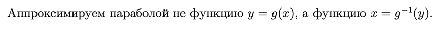
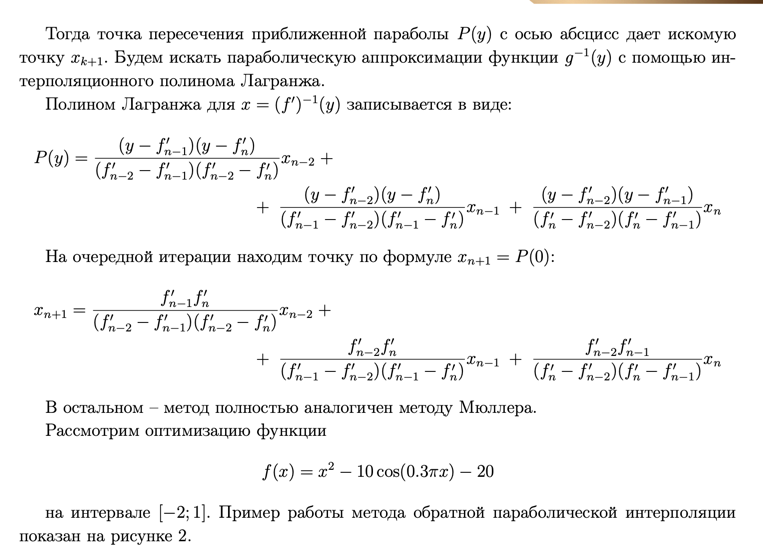
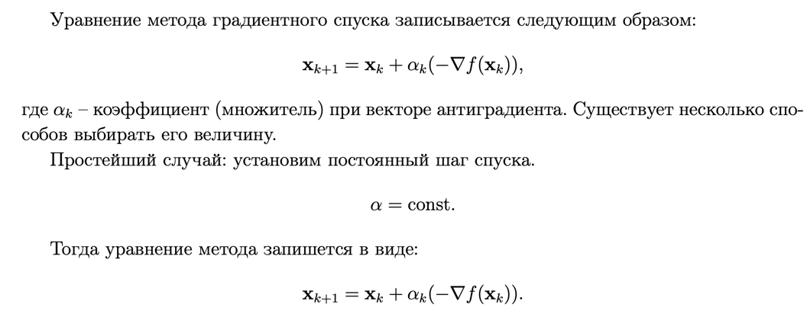

**Задание 1**

Ссылка на конспект
Метод параболической интерполяции

Преимущества и недостатки метода обратной параболической интерполяции:
1. Метод ищет только вещественные корни полинома P(y).
2. Сходимость метода больше, чем у метода секущих, но меньше, чем у метода Ньютона.
3. Если функция недостаточно гладкая или начальные точки выбраны неудачно, метод
может не сойтись.

**Задание 2**

[Ссылка на конспект](https://open.etu.ru/assets/courseware/v1/ce7fc0e8a683f155ee27926f498c34a8/asset-v1:kafedra-cad+opt-methods+spring_2024+type@asset+block/%D0%BA%D0%BE%D0%BD%D1%81%D0%BF%D0%B5%D0%BA%D1%823_1.pdf)
Метод градиентного спуска

[КОД](https://open.etu.ru/courses/course-v1:kafedra-cad+opt-methods+spring_2024/courseware/36e24e85aa75401a9ac7002730b64bb0/3e1a5b31f6eb43858f7ecae93d3be386/?child=first)

**Смысл метода:** использовать направление антиградиента как направление перемещения, а величину антиградиента использовать для управления длиной шага. Антиградиент всегда направлен
в сторону уменьшения целевой функции, а при удачном стечении обстоятельств он указывает прямо на минимум.

Методами спуска данные методы называются потому, что каждое следующее значение
целевой функции должно быть меньше предыдущего.

**Уравнение метода:**

Проблемы такого подхода:
1. Выбор шага зависит от задачи.
2. Устойчивость метода не гарантируется, сходимость тоже.