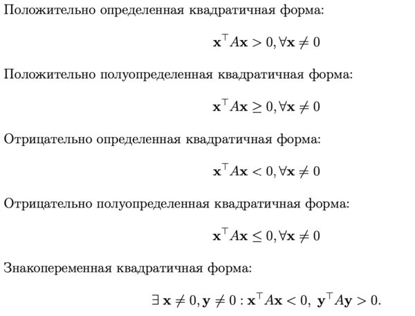
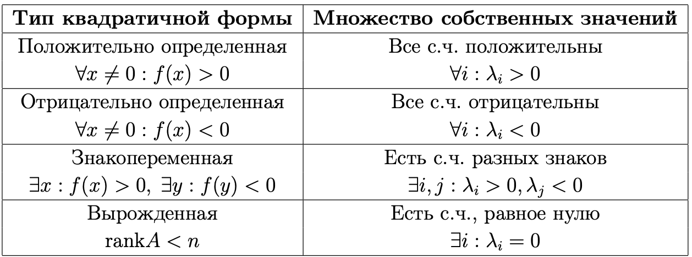

***Билет 5***\
**Квадратичная форма. Квадратичная функция. Связь знакоопределенности и собственных чисел матрицы.**

**Квадратичная форма** – функция на векторном пространстве, задаваемая однородным многочленом второй степени от координат вектора\


В зависимости от знака принимаемых квадратичной формой значений, различают по-
ложительно определенную, положительно полуопределенную, отрицательно определенную, отрицательно полуопределенную и знакопеременную квадратичные формы.



Для матрицы A **собственными числами и собственными векторами** называются такие числа λi и вектора vi, что


Смысл собственного вектора – умножение его на матрицу A дает коллинеарный вектор, умноженный на некоторое скалярное значение.

Квадратичная функция – функция вида


где c – скаляр, b – вектор, A – матрица.

Связь знакоопределенности и значений собственных чисел иллюстрирует таблица:


**Критерий минимума (максимума) дважды дифференцируемой функции векторного аргумента.**


[Конспект](https://open.etu.ru/assets/courseware/v1/98ff340fdb30155841a7af9315c3b889/asset-v1:kafedra-cad+opt-methods+spring_2024+type@asset+block/конспект1_5.pdf)


***Запрограммировать  метод  Полака-Рибьера. Показать его работу на функциях Sphere и Holder Table, размерность d = 2***
[КОД](https://open.etu.ru/courses/course-v1:kafedra-cad+opt-methods+spring_2024/courseware/36e24e85aa75401a9ac7002730b64bb0/d9acc0c322074580a3a52d45be116b2c/2?activate_block_id=block-v1%3Akafedra-cad%2Bopt-methods%2Bspring_2024%2Btype%40vertical%2Bblock%40cbf3f93d6d6145a7bb10d97b35917cd0)

```python

def prsearch(f, df, x0, tol):
    # PRSEARCH searches for minimum using Polak-Ribiere method
    # 	answer_ = sdsearch(f, df, x0, tol)
    #   INPUT ARGUMENTS
    #   f  - objective function
    #   df - gradient
    # 	x0 - start point
    # 	tol - set for bot range and function value
    #   OUTPUT ARGUMENTS
    #   answer_ = [xmin, fmin, neval, coords]
    # 	xmin is a function minimizer
    # 	fmin = f(xmin)
    # 	neval - number of function evaluations
    #   coords - array of statistics

    c1 = tol
    c2 = 0.1

    coords = [x0]

    kmax = 1000
    amax = 3

    g0 = -df(x0)
    p0 = np.copy(g0)

    while (norm(g0) >= tol) and (len(coords) < kmax):
        # Ищем оптимальный размер шага
        ak = wolfesearch(f, df, x0, p0, amax, c1, c2)

        # метод спуска с использованием длины шага
        x0 = x0 + ak*p0

        gk = -df(x0)

        g_diff_transposed = (gk - g0).transpose()

        # Обновляем значение направления по методу Полака-Рибьера
        denom = np.dot(np.transpose(g0), g0)
        if denom != 0:
            b = np.dot(g_diff_transposed, gk)/ denom
        else:
            b = 0


        p0 = gk + b * p0

        g0 = -df(x0)
        coords.append(x0)

    answer_ = [x0, f(x0), len(coords), coords]
    return answer_
```
